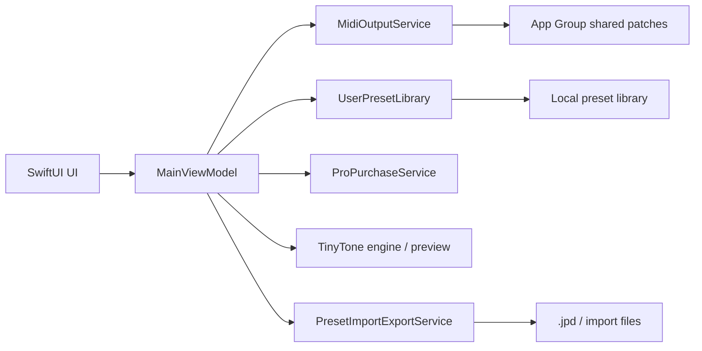

# ARCHITECTURE.md

JPad 全体の構造メモ。実装の境界を確認するときの正本。
細かいコード位置は変わることがあるため、作業前に必ず `rg` で現行ファイルを確認する。

## 全体像

JPad checkout のアプリ表示名は TinyRiff。内部では「パッド演奏」「MIDI 出力」「プリセット保存」「課金判定」「TinyTone 共有」を分けて持つ。

## 主要ファイル

| 領域 | 主なファイル |
|------|--------------|
| App entry | `JPad/App/JPadApp.swift` |
| Main screen | `JPad/Features/Main/MainView.swift` |
| Main state / workflow | `JPad/Features/Main/MainViewModel.swift` |
| MIDI routing settings | `JPad/Features/MidiRouting/MidiSettingsView.swift`, `JPad/Features/MidiRouting/MidiRoutingSettingsContent.swift` |
| Pad editor | `JPad/Features/PadEditor/PadEditorView.swift`, `JPad/Features/PadEditor/PadEditorViewModel.swift` |
| MIDI service | `JPad/Services/Midi/MidiOutputService.swift` |
| MIDI parser / builder | `JPad/Services/Midi/MidiMessageParser.swift`, `JPad/Services/Midi/MidiMessageBuilder.swift` |
| TinyTone preview | `JPad/Services/Audio/TinyToneEngine.swift`, `JPad/Services/Audio/TinyTonePatch+Factory.swift` |
| Preset model | `JPad/Models/Preset.swift`, `JPad/Models/Preset+Codable.swift`, `JPad/Models/PadDefinition.swift` |
| Local preset library | `JPad/Services/PresetLoading/UserPresetLibrary.swift`, `JPad/Services/PresetLoading/PresetLibraryModels.swift` |
| Import / export | `JPad/Services/PresetLoading/PresetImportExportService.swift`, `JPad/Services/PresetLoading/PresetShareZipArchive.swift` |
| Pro purchase | `JPad/Services/Purchases/ProPurchaseService.swift`, `JPad/Services/Purchases/ProSubscriptionStatus.swift` |
| Theme / pad visual | `JPad/Shared/Design/JChordTheme.swift`, `JPad/Shared/Design/PerformancePadPalette.swift`, `JPad/Shared/UI/PadView.swift` |
| Project generation | `project.yml`, `Makefile`, `scripts/fix-xcode-spm.sh` |

## UI

- 画面の入口は `JPadApp` と `MainViewModel`。
- UI は状態を表示するだけに寄せる。
- 画面切り替えやモーダルの制御は ViewModel 側に集める。
- 編集 UI、設定 UI、購入 UI は別責務として扱う。
- パッド本体の見た目は `PadView` と `PerformancePadPalette` を中心に確認する。
- 横表示やグリッド配置は `JChordPadLayout`, `PadGridLayoutGeometry`, `JChordMidiSlider` も確認する。

## MIDI

- `MidiOutputService` が MIDI 出力の中心。
- パッド発音、プレビュー、入力キャプチャはここを通す。
- UI は MIDI パケットを直接組み立てない。
- MIDI の接続状態、送信可否、プレビュー再生の初期化はサービス側で管理する。
- MIDI input の byte 解釈は `MidiMessageParser` を確認する。
- Active Sensing などの realtime message は実音や capture と混同しない。

## TinyTone

- TinyTone は TinyRiff の内蔵音色・プレビュー音源として扱う。
- ここは UI とは別に、音色パラメータと再生準備を持つ。
- JPad の保存データと TinyTone の共有データは同一ではない。
- App Group を使う場合でも、TinyTone 共有は「追加経路」であり、既存 JSON 経路を消さない。
- 現行実装では App Group 共有 patch の読込窓口は `MidiOutputService` 側にあり、TinyTone エンジン自身が共有 index を読む構造ではない。
- TinyToneCore は sibling checkout `../tinytone` から参照する前提。JPad 内で DSP の正本を複製しない。

## 保存

- ユーザーセットの正本はローカル保存。
- 編集結果はオートセーブ前提。
- 既存の共有・書き出し形式は、ローカル保存とは別に扱う。
- 保存の責務は `UserPresetLibrary` と `PresetImportExportService` に分ける。
- `Preset` / `PadDefinition` の encode / decode 変更は互換性を最優先する。
- `docs/DATA_FORMATS.md`, `docs/PRESET_LIBRARY.md`, `docs/PRESET_STORAGE.md` と矛盾させない。

## 課金

- 課金状態は `ProPurchaseService` で判定する。
- 課金は保存件数、複製、共有、取り込み制御に影響する。
- 課金判定は UI 表示だけでなく、保存・共有の実処理にも反映する。
- Product ID は `com.jflickeys.jchord.pro.yearly`。JPad 名に合わせるためだけに ID を変えない。

## App Group

- App Group は主に TinyTone 共有音色のための追加レイヤー。
- 共有データは `index.json` と個別 patch file に分ける。
- JPad は共有データを read-only で読む前提を基本にする。
- 現行コードでは `MidiOutputService` 内の共有ライブラリ reader が App Group を読み、選択した patch data を TinyTone プレビュー再生へ渡す。
- 保存済みローカルセットの正本を App Group 側に安易に移さない。
- App Group 共有は manual JSON LOAD / EXPORT の置き換えではない。

## 境界

- UI が保存形式を知りすぎない。
- MIDI が課金状態を直接判断しない。
- 保存が描画ロジックを持たない。
- 共有データがローカルセットの正本を上書きしない。
- RAG の古い要約が現行コードと食い違う場合は、現行コードとこの文書の更新を優先する。
