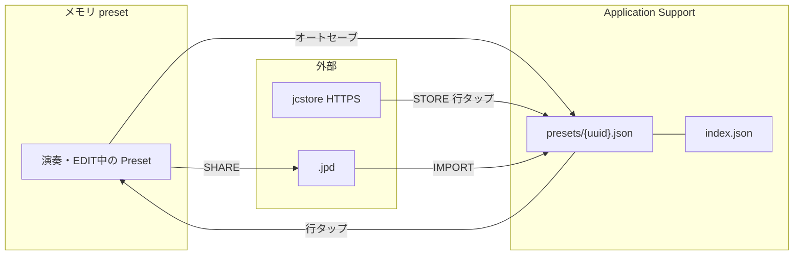

# JPad プリセット・ライブラリ仕様

## 概要

- 演奏・編集の単位は **ユーザーライブラリのスロット** のみ。
- **`JPad/PresetBundles/*.json`** をアプリ起動時に列挙。コード側の一覧ハードコードはしない。初回のみシード。
- **jcstore** は全ユーザー利用可（無料は store 由来同時1件）。
- **SHARE / IMPORT** = AirDrop 等の **共有シート**（自分のセットを `.jpd`（ZIP）として渡す / 受け取る）。ローカル保存 UI ではない。**MY SETS ピッカー下部に表示**（未購入はロック → `ProUpgradeSheet`）。
- **LOAD / SAVE ボタンは出さない**。MY SETS の編集は **オートセーブ** が正本。

## エンタイトルメント

| | 無料 | Pro |
|---|------|-----|
| ユーザースロット数 | 5 | 100 |
| 全スロット EDIT | ○ | ○ |
| **＋ 空白セット** | ○ | ○ |
| **複製（doc.on.doc）** | × | ○ |
| 明示 SAVE / LOAD ボタン | なし（オートセーブのみ） | 同左 |
| オートセーブ | アクティブスロットのみ | 同左 |
| jcstore | store 同時 **1件**（入れ替え） | 無制限 |
| SHARE / IMPORT | ×（Pro 案内） | ○ |

**方針 B** — 複製と共有は Pro のみ。＋は Free も可。

`@AppStorage("jchord.presetSavePurchased")` + StoreKit 2 年額サブスクリプション（`com.jflickeys.jchord.pro.yearly`）。未購入時は `ProUpgradeSheet`。

## ストレージ

```
Application Support/JPad/library/user/
  index.json
  presets/{uuid}.json
```

### index.json

- `activePresetID`: 現在演奏中スロット（スロット0件のときは `null`）
- `hasCompletedInitialSeed`: 初回バンドル5シード済みなら `true`
- `items[]`: `id`, `setName`, `savedAt`, `seedTemplateID?`, `storeCatalogID?`, `origin`（`seed` | `user` | `store`）

### presets/{id}.json

- `formatVersion`, `savedAt`, `seedTemplateID?`, `origin`, `preset`（既存 `Preset`）

## 初回・マイグレーション

1. レガシー `user-preset.json` があれば **1 スロット目** に取り込み（`hasCompletedInitialSeed = true`）。
2. **ライブラリが空** かつ `hasCompletedInitialSeed == false` のとき、`PresetBundles` 内の全 JSON をファイル名順に読み、枠上限までシード。
3. 以降、ユーザーが削除しても **自動でバンドルが戻らない**（アプリ内の「工場内容に戻す」操作は提供しない）。

## 削除

- **最後の1件も削除可能**（ライブラリ空になり得る）。
- 削除後は `ensureInitialized` で再シード **しない**。
- アクティブを消した場合は残り先頭をアクティブに。0件ならトップバーは **「セットなし」**、`Preset.fallback` のプレースホルダ表示のみ（**EDIT 不可**・パッド演奏も無効）。jcstore または Pro **NEW** で追加。

## UI（プリセットピッカー）

ビジュアル（外枠 `popupPanel`、iPad のみ白枠、フッター色など）: [UI_DESIGN.md](UI_DESIGN.md)

- 上部タブ **MY SETS | STORE** で切り替え。
- **MY SETS** = ライブラリスロット。行に **登録日時**（`savedAt`）と origin ラベル。
- **STORE** = jcstore カタログ（`manifest.json`）。行に **公開日**（`publishedAt`、日付のみ）と説明。タップで取り込み。
- プルダウン（STORE タブ）で manifest を再取得。
- **Preview in browser** = Web カタログ `https://flicker-jp.com/jcstore/` を Safari で開く（実装がある場合）。
- **ALL** チェック: 全スロットをメイン画面の `<` `>` セット巡回に含める（オフ時は行ごとのチェックで個別指定）。
- 行の **ドラッグハンドル**: MY SETS の並べ替え（`onMoveSlot`）。
- **＋行** の背景: 外枠と同じ `popupPanel`（白 5%）。リスト行本体は `panel`。

### ボタンの役割（いまの実装）

| UI | 状態 | 役割 |
|----|------|------|
| **MY SETS 行タップ** | 常時 | そのスロットを **アクティブ** にし、ディスクから読み込んで演奏・EDIT。切り替え前のアクティブスロットは **オートセーブ**。 |
| **＋** | 枠に余裕 | **空白セット**を新規追加（Free / Pro）。 |
| **複製（doc.on.doc）** | Pro・枠に余裕 | アクティブ内容を複製して **新スロット** を追加。 |
| **SHARE** | Pro | アクティブスロットを一時 `.jpd`（ZIP）に書き、**共有シート**（AirDrop 等）で渡す。 |
| **IMPORT** | Pro | 他端末などから受け取ったファイルをライブラリに取り込む。 |

**LOAD / SAVE ボタンは廃止**（利用者にはオートセーブだけ伝える）。

### セット巡回（メイン画面 `<` `>`）

- `PresetRotationSettings` + `MainViewModel.rotationSlotsInOrder`
- **ALL** オン: ライブラリ全スロットを巡回対象
- **ALL** オフ: 各行チェックで含めるスロットのみ（2 件以上で `<` `>` 有効）
- 切り替え時もアクティブスロットは **オートセーブ** してから読み込み

### MIDI パフォーマンス（セット横断）

- **Velocity / Expression** はプリセット JSON ではなく `@AppStorage`（`MidiPerformanceSettings`）で **全セット共通**
- キー: `jpad.midi.velocity` / `jpad.midi.expression`、既定値 100

### オートセーブ（唯一の「保存」体験）

アクティブスロットがあるとき、次のタイミングで `presets/{id}.json` に書き込む（`persistActiveSlotIfNeeded`）。

- パッド編集の反映後
- Velocity / Expression 変更
- 別スロットへ切り替える直前
- アプリがバックグラウンドへ行くとき
- jcstore 取り込み前 など

「元に戻す」は編集前の状態を覚えていない限りアプリ側では提供しない（LOAD 相当 UI なし）。工場 SET が必要なら STORE から再取り込みする。

## JSON の読み書きフロー

アプリ内には **3 系統** ある（ファイル形式が少し違う）。

```
┌─────────────────────────────────────────────────────────────────┐
│ 1. ライブラリ（MY SETS）— いつもここが演奏の正本                    │
└─────────────────────────────────────────────────────────────────┘
  index.json          … スロット一覧・activePresetID
  presets/{uuid}.json … PresetSlotDocument（下記）

  読: 行タップ / 起動時 bootstrap
  書: オートセーブ / NEW・削除・jcstore取り込み時の内部処理

┌─────────────────────────────────────────────────────────────────┐
│ 2. jcstore（STORE タブ）— 公式カタログからコピー                    │
└─────────────────────────────────────────────────────────────────┘
  manifest.json       … 取り込み許可リスト（id, title, publishedAt, path）
  presets/{id}.json   … 素の Preset JSON（Web / バンドル / HTTPS）

  読: HTTPS（失敗時バンドル）→ Preset をデコード
  書: 取り込み時に (1) の PresetSlotDocument として新規 or 上書き
       origin=store, storeCatalogID 付き

┌─────────────────────────────────────────────────────────────────┐
│ 3. SHARE / IMPORT — ファイル共有（Pro・UI 表示）                     │
└─────────────────────────────────────────────────────────────────┘
  *.jpd             … ZIP 入れ物（中に PresetExportEnvelope の .jpd）

  SHARE 書: アクティブ → 一時 .jpd → 共有シート
  IMPORT 読: ファイル → Preset → importSharedUserPreset → (1) へ
  制約: SHARE は origin=user のスロットのみ
```

### (1) ライブラリ JSON: `PresetSlotDocument`

```json
{
  "formatVersion": 2,
  "savedAt": "2026-05-18T12:00:00Z",
  "seedTemplateID": "jazz-fusion",
  "origin": "seed",
  "preset": { … Preset 本体 … }
}
```

- `origin`: `seed` | `user` | `store`（seed を編集して SAVE すると `user` に昇格）
- コード: `UserPresetLibrary` / `PresetLibraryModels.swift`

### (2) jcstore: 素の `Preset`

```json
{
  "id": "jazz-fusion",
  "setName": "Jazz Fusion",
  "pads": [ … ],
  …
}
```

- ホワイトリスト: manifest の `id` + `flicker-jp.com/jcstore/` 配下 URL のみ
- コード: `JcstoreService` → `UserPresetLibrary.importStorePreset`

### (3) 共有ファイル: `PresetExportEnvelope`

```json
{
  "formatVersion": 2,
  "kind": "preset",
  "exportedAt": "…",
  "slotName": "My Custom Set",
  "origin": "user",
  "preset": { … }
}
```

- IMPORT は `.jpd` / 旧 `.jch`・`.jchord` 等（PresetExportEnvelope）
- コード: `PresetImportExportService`
- UI: MY SETS フッターに SHARE / IMPORT（Free はロック表示 → Pro 案内）

### フロー図（ユーザー操作）



## jcstore

### Web とアプリの「index」

| 種類 | URL / ファイル | 用途 |
|------|----------------|------|
| アプリ用カタログ | `manifest.json` | ホワイトリスト・タイトル・`publishedAt`（`yyyy-MM-dd`）・`path` |
| Web トップ | `index.html`（`/jcstore/`） | ブラウザ試聴用デモ UI。アプリは必須ではない |
| プリセット本体 | `presets/{id}.json` | 取り込み・Web 試聴 |

- バンドル: `jcstore-manifest.json`（オフライン fallback）
- 本番: `https://flicker-jp.com/jcstore/manifest.json`
- 無料: store 由来スロット同時 **1件**（追加時は入れ替え先を選択）
- Pro: store 取り込み無制限・**NEW** でスロット複製（最大100）
- リモート preset JSON（manifest の `path` + `baseURL`、失敗時バンドルへフォールバック）

## SHARE / IMPORT（Pro）

| 項目 | 内容 |
|------|------|
| 意味 | **共有**（AirDrop / メール等のシステム共有シート）。自分用の「ファイルに保存」ボタンではない。 |
| SHARE | アクティブセット → `.jpd` → `UIActivityViewController` |
| IMPORT | 他者・他端末から受け取った `.jpd` 等 → ライブラリへ |
| UI | MY SETS ピッカー下部。未購入はグレー表示 → `ProUpgradeSheet` |
| 購入 | StoreKit 2 年額 `com.jflickeys.jchord.pro.yearly`（`docs/APP_STORE_SUBSCRIPTION.md` 参照） |

## Phase 3（未実装・一部完了）

| 項目 | 状態 |
|------|------|
| セット巡回（`<` `>`） | **実装済み**（ALL / 行チェック） |
| StoreKit 年額 Pro | **実装済み**（ASC 商品登録・審査要） |
| アーカイブ（一括 export/import） | 未 |
| ディープリンク `jchord://import?url=...` | 未 |
